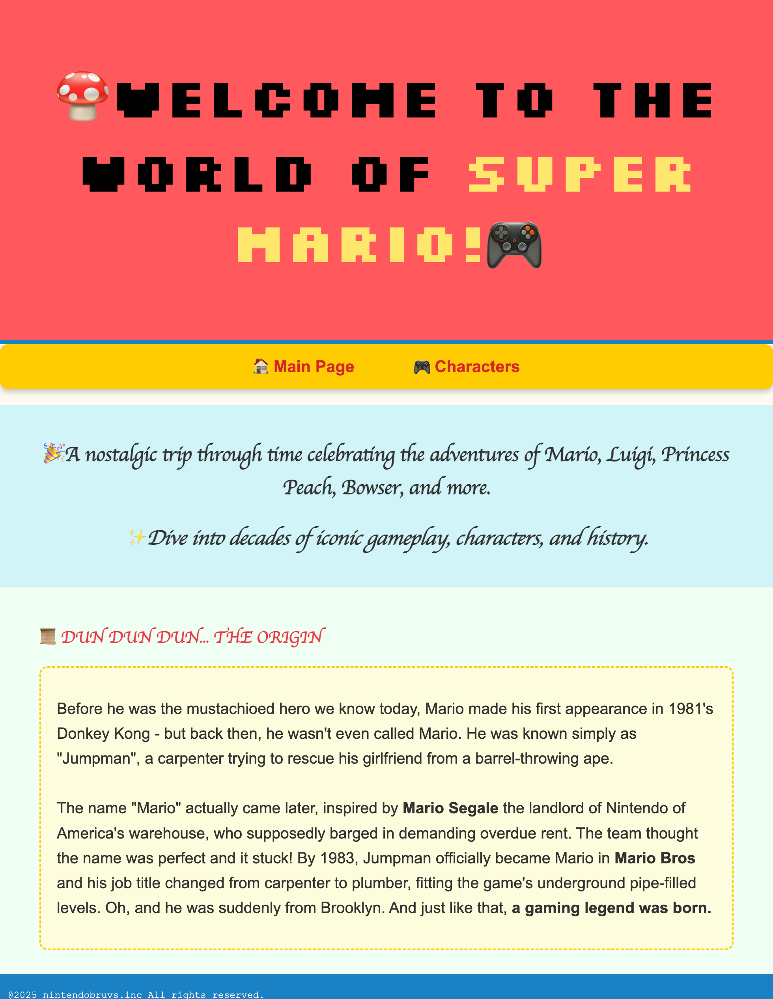
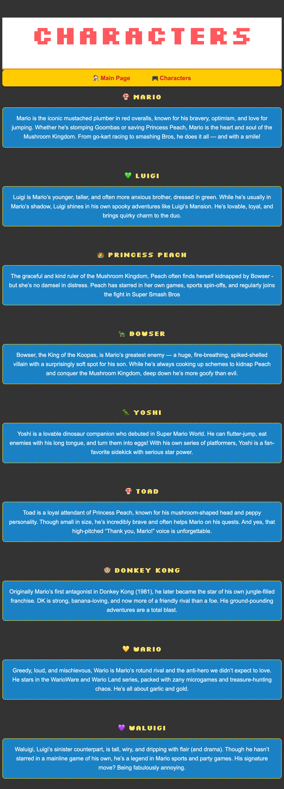
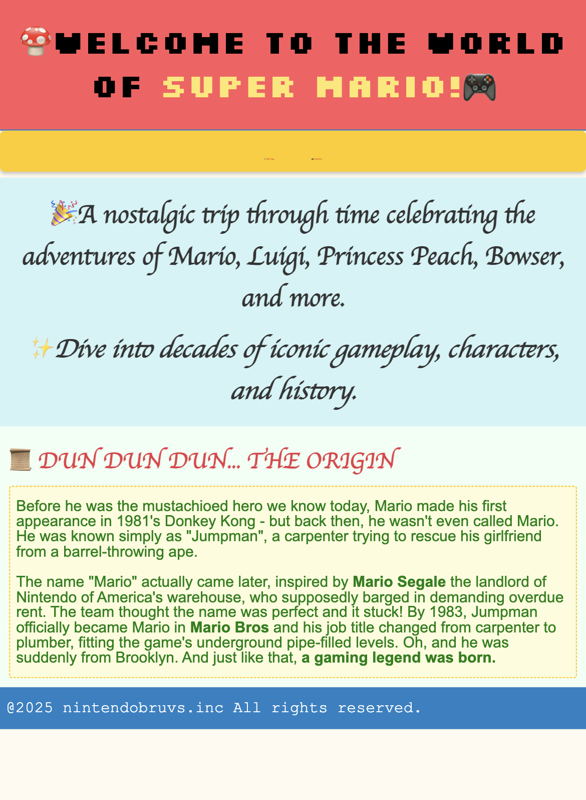
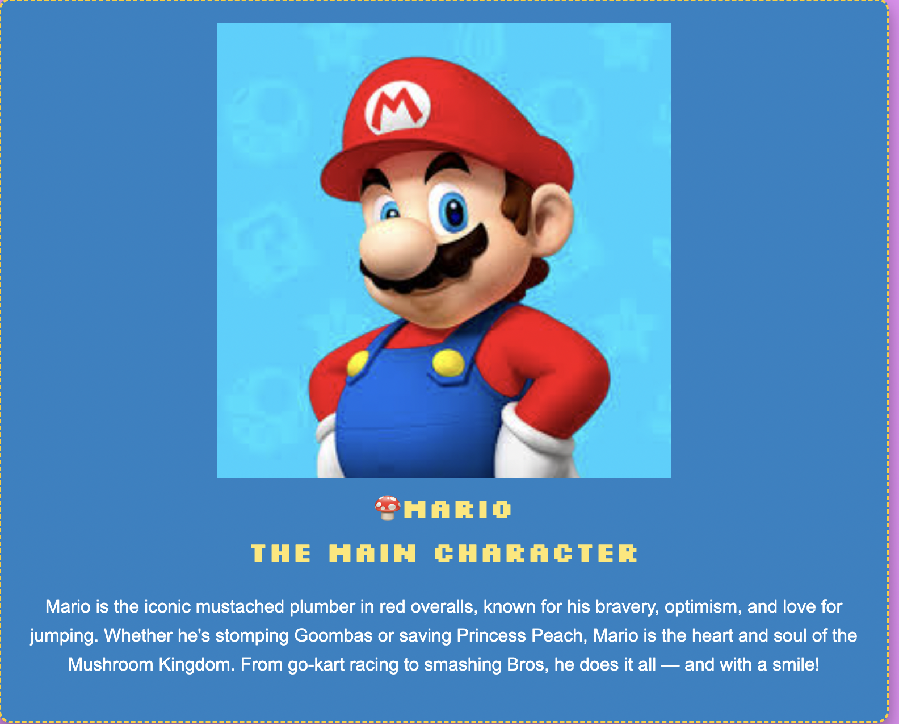

# Web Page creation and styling using HTML CSS

## Task 1: **Static Webpage Layout**

    -  Create a single-page website using semantic HTML elements such as `<header>`, `<nav>`, `<main>`, and `<footer>`.

**Soln:**

    - created a main webpage <mainpage1.html> with semantic elements + content
    - created stylesheet <style1.css> to decorate the main page
    - created a second webpage <characters.html> and added navigation links to the main page. Decorated the page with <style2.css>
    - defined media query in <style1.css> to account for portrait mode in phones.

**Main page:**

**Second page:**

**Displaying media query:**

As you can see, the font size is adjusted and the body text also turns to green.

## Task 2: CSS Card Component with Hover Effects

    - Build a card that includes an image, a title, and a description.

**Soln:**

    - created a div container - 
, included image along with a description
    - added styling to the cards to include colors, shadows and hover effects.
    - when hovering over the image, the image expands

**Character card:**

**Hover effect:**

