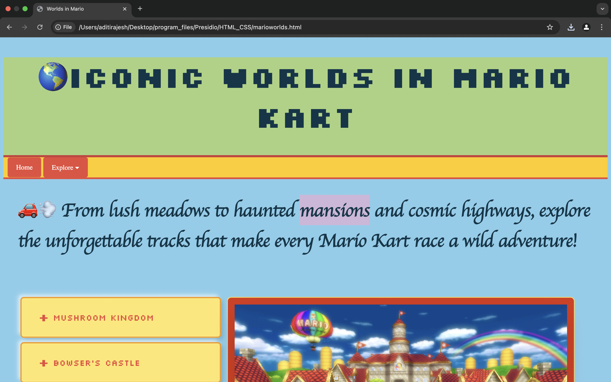
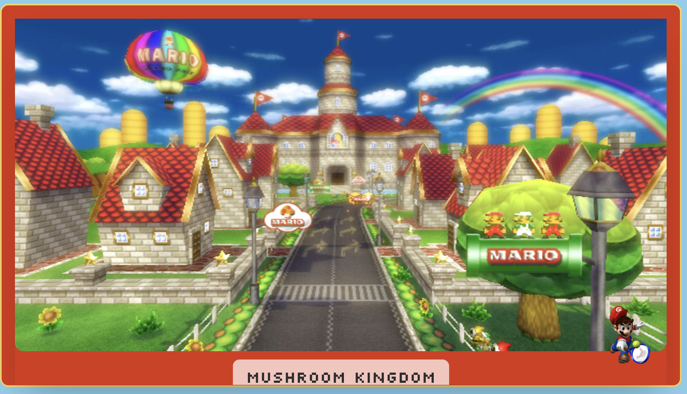

# TASK 9: **Complex Responsive Layout with Grid and Flexbox**

## **Objective:**

-Design a sophisticated webpage layout that combines CSS Grid and Flexbox techniques.

## Solution:

- created a grid template in the <marioworlds.html> page - 2 columns
- used flex to align items column-wise - on the right side (slideshow and gif)
- added overlays using z-index (mario icon floating on top of the slideshow)
- made the navigation bar sticky using position:sticky

## Grid + flex alignment

## Overlay

## Sticky Navigation Bar:
